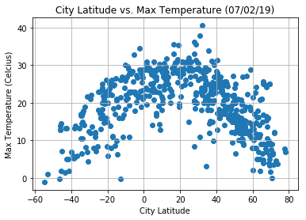
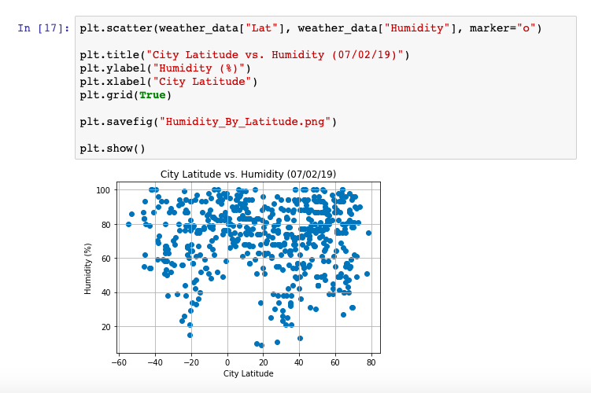

# Python-API-Weather
This program uses API calls and the Pandas library to analyze global weather patterns.

In this program, latitude is the independent variable, a variety of weather phenomena are measured as potential dependent variables, and cities are the unit of analysis. The program assembles a representative list of cities across the world by generating sets of random coordinates and finding the closest city from the Citipy library ([Citipy](https://pypi.org/project/citipy/)). The program matches each city to its weather statistics by making calls to the openweathermap API ([Openweathermap](https://openweathermap.org/api)). Finally, the program organizes and plots the data using Pandas and Matplotlib. The entire program is organized using a Jupyter notebook.

Analysis of the program's output provides users with a few key findings. First, mean temperatures are highest in cities that are closer to the equator. Second, cities with low humidity are concentrated in the middle latitudes. And third, wind speed and cloudiness have a relatively uniform distribution at all latitudes. Graphic outputs are included below for clarity:

/

