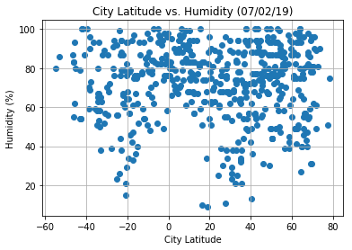

# Python-API-Weather
This program uses API calls and the Pandas library to analyze global weather patterns by latitude.

Technologies Used: Python, Pandas, MatPlotLib, Jupyter Notebook, Citipy API, Openweathermap API

In this program, latitude is the independent variable, a variety of weather variables are evaluated as potential dependent variables, and cities are the units of analysis. First, the program assembles a list of cities around the world by generating sets of random coordinate pairs and using the [Citipy](https://pypi.org/project/citipy/) library to find a city near each pair. Next, it retrieves weather statistics for each city by making calls to the [Openweathermap](https://openweathermap.org/api) API. Finally, it organizes and plots the data using the Pandas and Matplotlib libraries. The program is built using a Jupyter notebook.

Analysis of the program's output yields a few key findings. First, mean temperatures tend to be higher in cities that are closer to the equator. Second, lower humidity is most common in cities located in the middle latitudes. And third, both wind speed and cloudiness have a relatively uniform distribution at all latitudes. Included below are a few of the program's graphic outputs:

/

